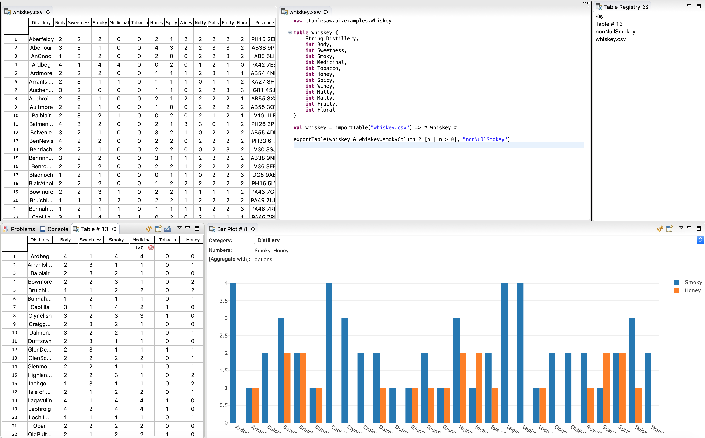

# etablesaw - Eclipse integration for jtablesaw/tablesaw (data frame library for java)

The [Tablesaw](https://github.com/jtablesaw/tablesaw) data frame library provides capabilities similar to Python pandas. It has classes for tables and columns for various types and lots of ways of analysing and manipulating them, e.g. filter, slicing, aggregating and running statistics. It even integrates with [Smile](http://haifengl.github.io) to provide more advanced statistics and machine learning features.

The goal of etablesaw is to turn Eclipse into a workbench for working with data frames based on tablesaw. Currently it provides:

- a [data frame editor](table-editor.md) based on [NatTable](https://www.eclipse.org/nattable/) supporting CSV and Excel file formats
- [views](views.md) for viewing and deriving table data, including table and various charts
- a [table registry](table-registry.md) that allows workbench parts (table data providers) to be the source of table data in other parts (table data consumers)
- [a scripting DSL](xaw.md) based on [Xtext and Xbase](https://www.eclipse.org/Xtext/documentation/305_xbase.html) that gives a more interactive Tablesaw experience by integrating with the rest

Most features are extensible, e.g. it's easy to add new file formats to the editor or new chart views.

The screenshot below illustrates some of etablesaw's features:

- the data frame editor (upper left)
- xaw script editor (upper middle)
- table registry view, for linking table data providers and consumer 
- table viewer with row filter (lower left)
- bar chart view

## The data frame editor

The **Tablesaw table editor** allow viewing and editing table data. Currently it supports CSV (read/write) and Excel file formats (read only). Rows can be filtered using expression on columns and columns may be hidden. Columns may be updated using expressions, and new ones added. Simple variants of delete and copy & paste are supported.

[Read more...](table-editor.md)

## Viewing and plotting table data

There are several views for table data. The **Tablesaw viewer** provides the viewer features of the editor, e.g. supports filtering rows using expressions and hiding columns.

The table summary and crosstab views derive new tables from existing ones.

The plotting views supports various charts, e.g. bar and line charts. Each view includes controls for selecting the columns relevant for the chart. Some also support aggregating data.

[Read more...](views.md)

## Linking table providers and consumers

The table data registry allows table data providers and consumers to be linked, e.g. the data in the editor to be plotted in the bar chart view. A workbench part registers to *provide table data* that other parts may consume. The providers may notify the consumers that the table data has changed, to dependent workbench parts may be updated.

Both the table editor and view provide the currently filtered and selected table data through this mechanism. Hence, a bar chart linked to an editor will update when the row selection changes or a filter is applied. The views that derive new table data also provide the resulting table. This allows e.g. a crosstab to be plotted.

[Read more...](table-registry.md)

## Xaw Scripting DSL

Although some data manipulation may be done in the editor and views, the power of the tablesaw library is unleashed by the **Xaw** scripting DSL. The Xaw language is basically syntactic sugar for Java provided out-of-box by Xbase, some extra table and column-oriented operators and literal syntax and extension methods for reading and writing files and linking it to the table data registry.

The scripts are translated to Java in the context of the classpath of the projects they're within, and can be executed within the workbench so they may consume table data from or provide table data to workbench parts.

A Xaw script typically load table data from one or more files, manipulates tables and columns, derive new tables and output the result. In addition, the integration with the table registry makes it possible to use intermediate and resulting table data as the source for views.

[Read more...](xaw.md)
