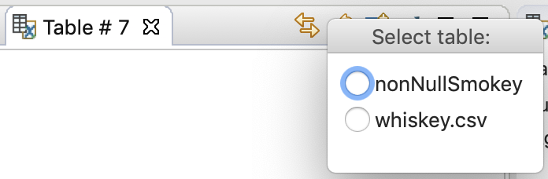
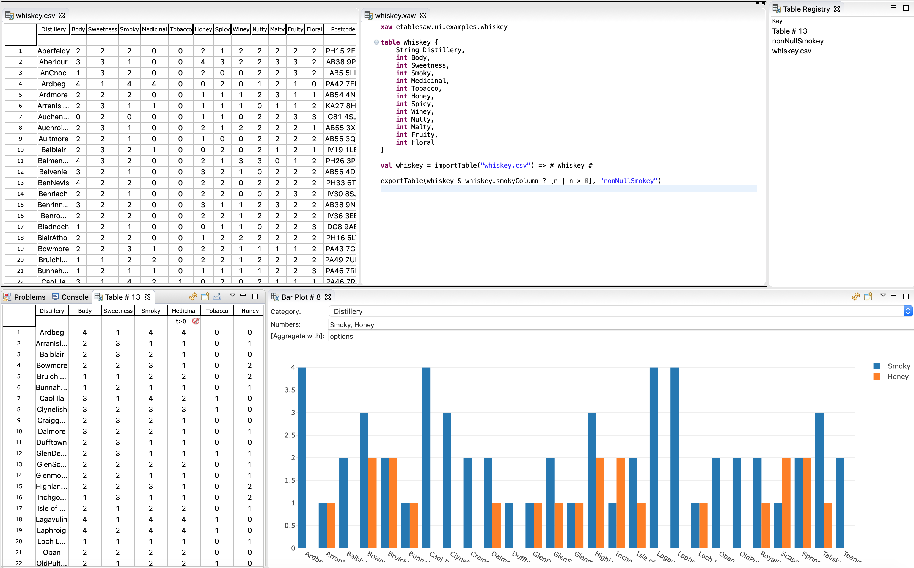

# Linking table providers and consumers

The table data registry allows table data providers and consumers to be linked, e.g. the data in the table editor to be plotted in the bar chart view. A workbench part registers to *provide* table data and later *notifies* its listeners when the table *data* or *structure* changes. Other parts may lookup table providers by their key and react to notifications.

Both the table editor and view *provide* the currently sorted, filtered and selected table data through this mechanism. Hence, a bar chart linked to an editor will update when the row selection changes, sorting or a filter is applied. The views that *derive* new table data also *provide* the resulting table. This allows e.g. a crosstab to be plotted.

The views that *consume* table data from the registry allow the user to select the table source by clicking the link button (double straight arrows):

The [xaw](xaw.md) editor supports executing xaw scripts inside the workbench and may take part in this action. The script may *import* tables from the registry or *export* to it, thus when a script has run, the tables exported during the execution may be picked up and shown in other views.

The snapshot below shows the workbench with several (linked) parts:

- The currently available tables in the registry is shown in the Table Registry view (upper right).
- The file `whiskey.csv` has been opened in the Table editor (upper left). The current view of this table is automatically provided through the table registry, and since the `Row Id` column has been hidden (thus not shown) it is not available to consumers.
- The script in the xaw editor (upper middle) declares the `Whiskey` table type with only the taste-related columns. The `whiskey.csv` table is imported and populates a new instance of the `Whiskey` table type. Then a new table is created, based on selecting the rows with a `smokeyColumn` value greater than zero. This table is exported with the `nonNullSmoky` key.
- The Table # 13 view (lower left) uses the `nonNullSmoky` table as its source (selected using the **Tables** meny in the view drop-down, and shown in the view title tool tip). A filter has been added to the `Medicinal` column. The resulting table view is automatically provided through the table registry.
- The Bar Chart view  (lower right) uses the `Table # 13` table as its source and shows the `Smoky` and `Honey` values for each `Distillery`. If the filter in the Table # 13 view is changed or cleared, the bar chart will update accordingly.  

