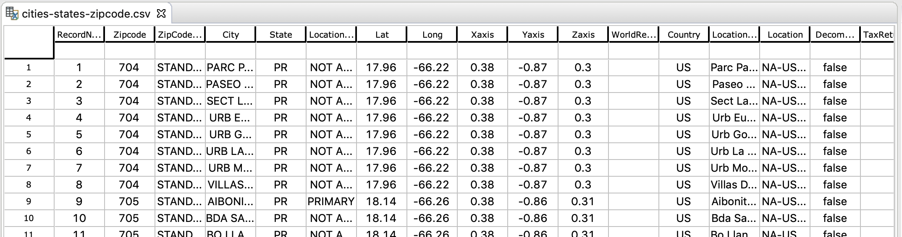
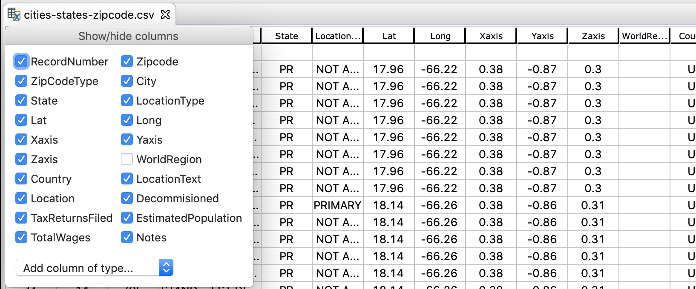
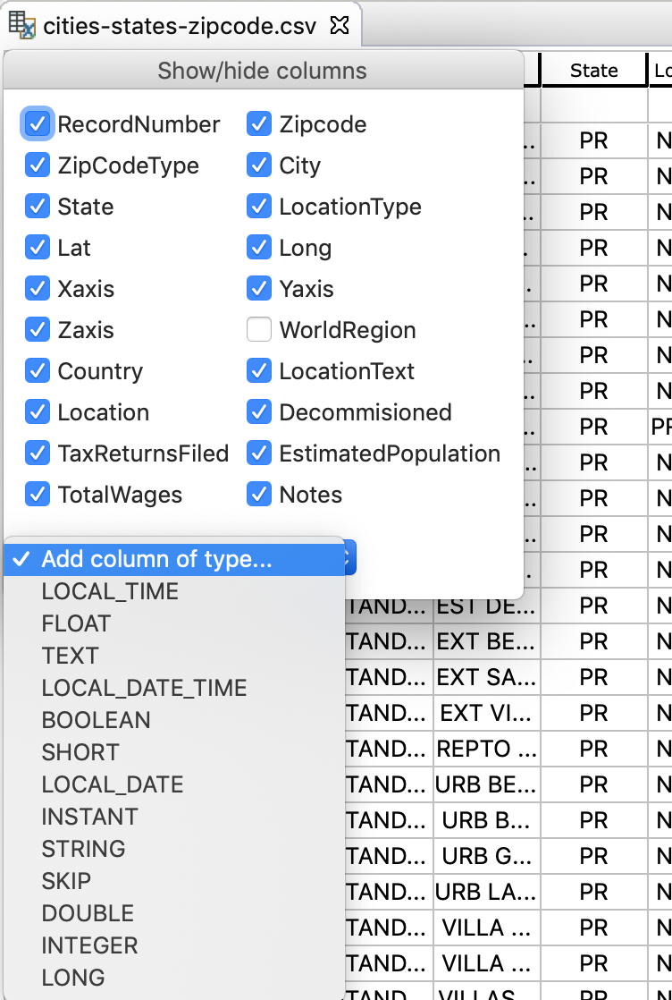
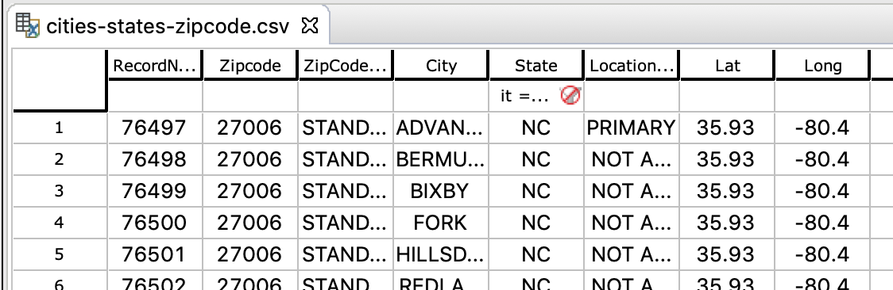
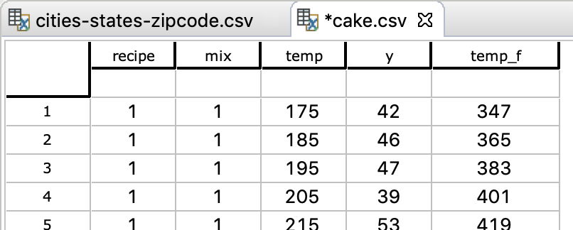

# The table editor

The **Tablesaw table editor** allow viewing and editing table data. Currently it supports CSV (read/write) and Excel file formats (read only). Rows can be filtered using expression on columns and columns may be hidden. Columns may be updated using expressions, and new ones added. Simple variants of delete and copy & paste are supported.

Below the editor is shown opened on the **cities-states-zipcodes.csv** sample file (in the tablesaw **data** folder).

## Operating on columns

To hide/show columns, click the corner cell and deselect/select the column:

To add a new column, click the corner cell and select the desired column type in the drop-down:

To rename an existing or new column, double-clicking the column name and enter the new name.

## Using expressions

If an expression language is installed, e.g. xaw, you may use it for filtering rows or filling columns with computed values. The [xaw DSL](xaw.md) is provided as the default language.

To filter the rows on an expression, enter an expression in a cell below the column header row. The expression is evaluated on each row, and the row will be shown if the expression returns true, otherwise it'll be hidden.

The expression may refer to any column, using a syntax specific for the expression language, typically the column name or an identifier derived from it the name contains illegal characters. E.g. xaw replaces all illegal identifier characters (when **Character.isJavaIdentifierPart** returns **false**) with an underscore, and adds an initial underscore for illegal initial characters (when **Character.isJavaIdentifierStart** returns **false**).

The column that the expression is entered into will typically be available using a shorthand. E.g. xaw allows **it** as shorthand for "this column's value".

In the screenshot below, the table is filtered to only show rows where the state is "NC" (North Carolina).

Multiple expressions may be entered, in case all of them must return true for a row to remain visible.

The expression is cleared by clicking on the stop sign.

Another use of expressions is filling columns with computed values. Preceding an expression with an equal sign (=) will compute a new value for each column cell by evaluating the expression on the corresponding row. The screenshots below shows how a newly created column named **temp_f** is filled with Farenheit values corresponding to the **temp** Celcius value using **=temp*1.8+32**.

&nbsp;&nbsp;&nbsp;

